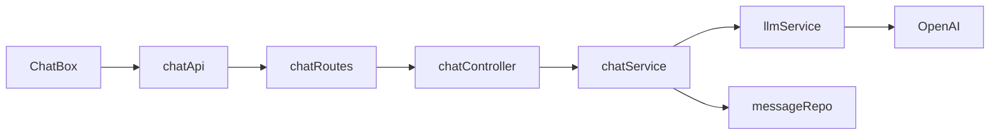

# Spur AI Chatbot

React chat UI + Express API + OpenAI (LangChain) for customer support.

## Run locally

### Prerequisites

- Node.js 18+
- npm

### Backend

1. `cd chatbotBackend && npm install`
2. Create `chatbotBackend/.env`:

```env
OPENAI_API_KEY=your_openai_api_key
```

3. `npm run dev`
4. Server runs at `http://localhost:5000` (check your local port in the terminal) — verify with `GET /health`

### Frontend

1. `cd aichatbot && npm install`
2. Create `aichatbot/.env`:

```env
REACT_APP_API_URL=http://localhost:5000
```

Use the same host/port as your running backend (check your local port).

3. `npm start`
4. App opens at `http://localhost:3000` (check your local port if 3000 is in use)

## Database setup

No migrations or seed scripts. SQLite is auto-created on first backend start:

| File | Purpose |
|---|---|
| `chatbotBackend/data/chat.db` | UI message history |
| `chatbotBackend/data/agent-checkpoints.db` | LangGraph LLM thread memory |

Schema is applied in `chatbotBackend/src/db/index.js` via `CREATE TABLE IF NOT EXISTS`.

## Environment variables

| Variable | Location | Description |
|---|---|---|
| `OPENAI_API_KEY` | `chatbotBackend/.env` | OpenAI key for LangChain agent |
| `REACT_APP_API_URL` | `aichatbot/.env` | Backend base URL |

## Architecture

```
aichatbot/          React UI (ChatBox, chatApi)
chatbotBackend/src/
  routes/           HTTP endpoints (chat.routes.js)
  controllers/      Request/response handling (chat.controller.js)
  services/         Business logic + LLM (chat.service.js, llm.service.js)
  db/               SQLite connection + repository
  middleware/       Validation, error handling
  constants/        System prompt
```

**Request flow:** `ChatBox` → `chatApi` → `POST /api/chat/message` → `chat.service` → `llm.service` → OpenAI → persist to SQLite.

**Endpoints:**

- `GET /api/chat/history?sessionId=` — fetch conversation for UI
- `POST /api/chat/message` — send message, get bot reply



### Design decisions

- **Layered backend** — routes → controllers → services → repository; keeps HTTP, logic, and data access separate.
- **Dual storage** — `chat.db` for displayed history; LangGraph SQLite checkpointer for LLM thread context per `sessionId`.
- **Session-based, no auth** — frontend generates a UUID in `sessionStorage` and sends it as `sessionId`.
- **Grounded responses** — system prompt embeds company policies; bot must refuse unknown facts and unrelated questions.

## LLM

**Provider:** OpenAI (`gpt-5-nano`) via LangChain `createAgent`.

**Prompting:** Static system prompt in `chatbotBackend/src/constants/systemPrompt.js` defines role, conversation rules, security rules, and company knowledge (shipping, returns, COD, support).

**Memory:** LangGraph `SqliteSaver` checkpointer keyed by `sessionId` (`thread_id`), so the agent retains context across turns without the client re-sending full history.

## Trade-offs & If I had more time…

**Trade-offs:**

- SQLite suits local dev; multi-instance production needs shared storage.
- Long chats grow checkpoint size, increasing latency and cost.
- No auth on sessions — anyone with a `sessionId` can read that conversation.

**If I had more time:**

1. **Cache conversation history** — e.g. Redis to reduce DB reads on history load.
2. **Summarize after a length threshold** — compress older turns and keep only recent messages + summary in LLM context to control token usage.
